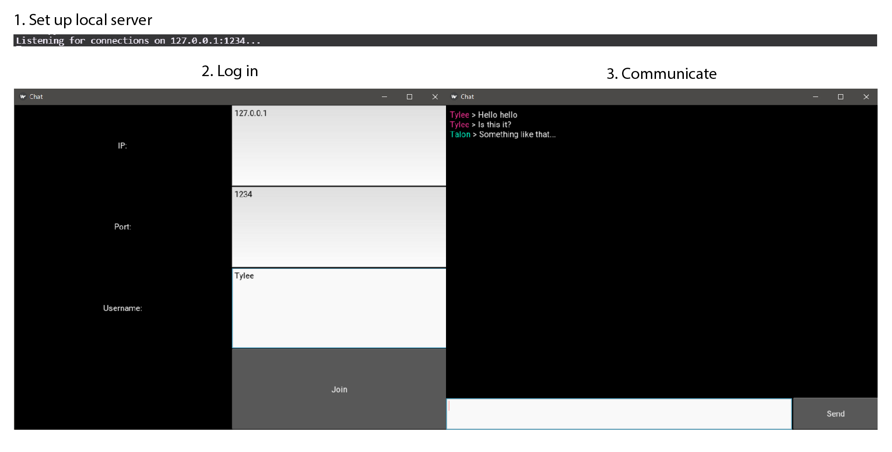

# Chat-App

Create a basic chat application for local server using the Kivy library.

## Process approach
1. (`socket_client.py` + `socket_server.py`) Create a local server responsible for the transferring of data.
2. (`app.py`) Build and finalize individual pages using Kivy widgets.
3. Set up local server and allow users to communicate.

## Results

